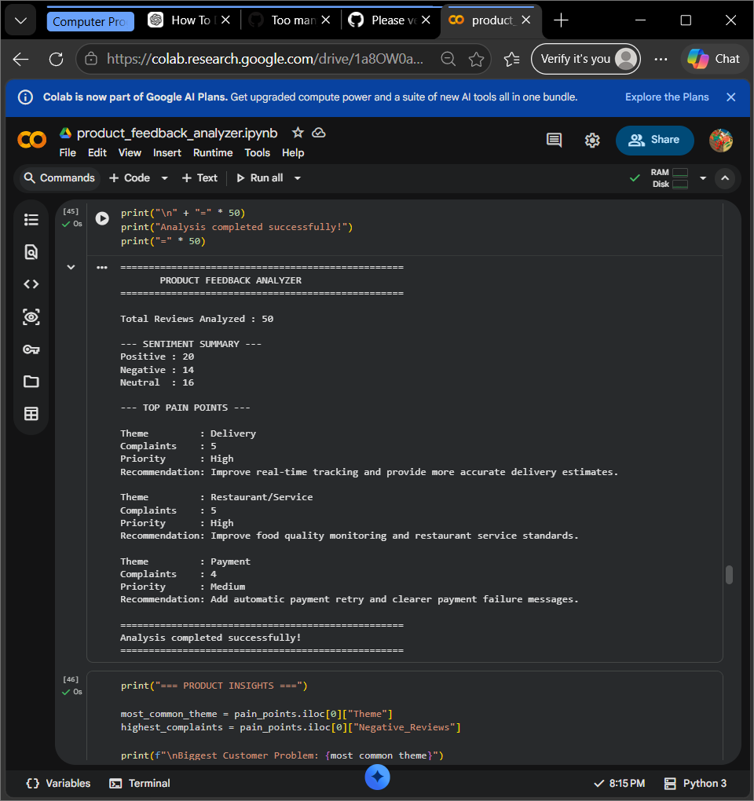

# Product Feedback Analyzer

## Overview

An NLP-based Python project that analyzes customer feedback and converts unstructured reviews into actionable product insights.

## Features

- Customer review analysis
- Text preprocessing and cleaning
- Sentiment analysis
- Customer theme detection
- Pain point identification
- Priority classification
- Product improvement recommendations
- Data visualization
- CSV file upload and analysis

## Technologies Used

- Python
- Pandas
- TextBlob
- Natural Language Processing (NLP)
- Matplotlib
- Google Colab

## Project Workflow

Customer Reviews  
↓  
Text Preprocessing  
↓  
Sentiment Analysis  
↓  
Theme Detection  
↓  
Pain Point Analysis  
↓  
Priority Classification  
↓  
Product Recommendations

## Key Results

The project analyzed 50 customer reviews and identified the major customer pain points.

The highest-priority issue was **Delivery**, with 11 negative mentions.

The recommended product improvement is to improve real-time delivery tracking and provide more accurate delivery time estimates.

## Business Value

This project demonstrates how customer feedback can be transformed into actionable product insights using Python, NLP, sentiment analysis, keyword-based theme detection, and data visualization.

## How to Run

1. Open `product_feedback_analyzer.ipynb`.
2. Open the notebook in Google Colab.
3. Run the cells from top to bottom.
4. Upload a CSV file containing customer reviews when required.

## Project Results

## Author

Hannishetty2627
